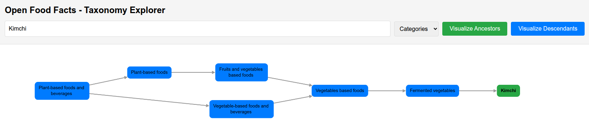

# Open Food Facts Taxonomy Explorer

1. Select an OFF taxonomy entry
2. Visualize its ancestors or descendants
3. Share the current view with URL parameters

## Extra info

* works with additives, allergens, categories, ingredients, labels, nutrients, origins
* limited to `en:`
* shows a loader and disables controls while a taxonomy is loading
* includes a footer link to the GitHub repository

## Shareable URLs

The app keeps state in query parameters and auto-loads from them:

* `taxonomy`: `additives | allergens | categories | ingredients | labels | nutrients | origins`
* `node`: taxonomy node id (example: `en:milks`)
* `mode`: `ancestors | descendants`

Example: `?taxonomy=categories&node=en:milks&mode=descendants`

## Screenshot



## Run locally

```bash
git clone
cd openfoodfacts-taxonomy-explorer
python -m http.server 8080
```

## Thanks to

* https://github.com/goerlitz/openfoodfacts-data-analysis/blob/main/notebooks/44_category_exploration.ipynb
* https://wiki.openfoodfacts.org/Taxonomies_introduction
